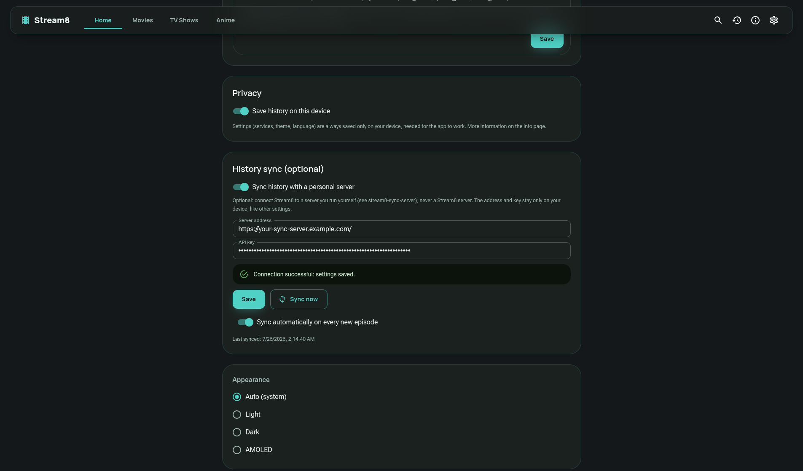

# 🔄 Stream8 Sync Server

<p align="center">
  
</p>

**Stream8 Sync Server** is a lightweight, self-hosted backend service built to manage real-time watch history, playback progress, and configuration synchronization for the **Stream8** ecosystem.

🌐 **Live Application:** [https://stream8.poppi.cc](https://stream8.poppi.cc)  
💻 **Frontend Repository:** [Stream8 Frontend](https://github.com/rizzonicola/stream8)

---

## ✨ Features

* **Real-time Sync:** Synchronize watch progress, history, and status across all your devices.
* **Self-Hosted & Lightweight:** Fast performance with low resource usage, designed for home servers and VPS deployments.
* **Docker Ready:** Includes pre-built Docker containers published via GitHub Container Registry (`ghcr.io`).
* **Seamless Integration:** Native API support designed specifically for the **Stream8** PWA.

---

## 📸 Screenshots

<p align="center">
  
</p>

---

## 🚀 Getting Started

### Prerequisites

* Docker & Docker Compose **OR** Node.js (v18 or higher)

---

### Option 1: Running with Docker (Recommended)

You can easily run the server using the pre-compiled Docker image hosted on GitHub Container Registry (`ghcr.io/rizzonicola/stream8-sync`).

1. **Create a `docker-compose.yml` file:**

```yaml
services:
  stream8-sync:
    image: ghcr.io/rizzonicola/stream8-sync:latest
    ports:
      - "8080:8080" # Web admin interface
      - "8081:8081" # API used by Stream8
    environment:
      ADMIN_USER: changeme
      ADMIN_PASSWORD: changeme-with-a-real-password
      DATA_DIR: /data
    volumes:
      - stream8-sync-data:/data
    restart: unless-stopped

volumes:
  stream8-sync-data:

```
 2. **Start the container:**
```bash
docker compose up -d

```
### Option 2: Build and Run with Docker Locally
If you prefer building the Docker image from source locally:
 1. **Clone the repository:**
   ```bash
   git clone [https://github.com/rizzonicola/stream8-sync.git](https://github.com/rizzonicola/stream8-sync.git)
   cd stream8-sync
   
   ```
 2. **Start the container:**
   ```bash
   docker compose up -d --build
   
   ```
### Option 3: Manual Installation
 1. **Clone and install dependencies:**
   ```bash
   git clone [https://github.com/rizzonicola/stream8-sync.git](https://github.com/rizzonicola/stream8-sync.git)
   cd stream8-sync
   npm install
   
   ```
 2. **Start the server:**
   ```bash
   npm start
   
   ```
## 🔗 Connecting with Stream8 Frontend
To pair this server with your frontend instance:
 1. Open your **Stream8** web app (https://stream8.poppi.cc or your local instance).
 2. Go to **Settings** -> **Sync Server**.
 3. Enter your server URL (e.g., https://your-sync-server.example.com or http://localhost:8081).
## 📄 License
Distributed under the **GNU General Public License v3.0 (GPLv3)**. See LICENSE for more information.
